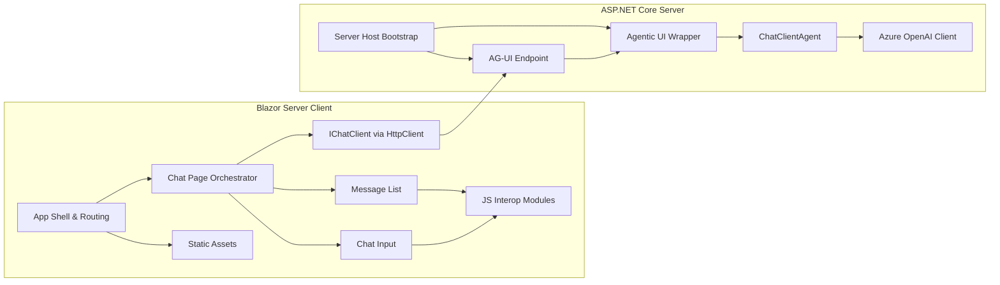

# AGUIWebChat Module Correlations

## Overview
This document describes how the AGUIWebChat modules interact at runtime, focusing on the request flow between the Blazor Server client, the AG-UI endpoint, and the Azure OpenAI-backed agent. The correlations align with the ASP.NET Core hosting model, Blazor component composition, and HTTP client usage patterns.

## Interaction Flow (High-Level)
1. The ASP.NET Core server host initializes services and maps the AG-UI endpoint.
2. The Blazor Server client host registers an `IChatClient` backed by `HttpClient` and renders the chat UI.
3. The chat page orchestrator component sends user input to the AG-UI endpoint using the registered client.
4. The server’s AG-UI endpoint routes the request through the Agentic UI wrapper to the `ChatClientAgent`, which invokes Azure OpenAI and emits state events.
5. Responses stream back to the Blazor UI, where message list components render text, state updates, and use JS interop for UI behaviors.

## Correlation Diagram

## Module Correlation Matrix
| From module                     | To module                    | Interaction           | Purpose                                                        | Primary files                                                                                                                                                                                                            |
| ------------------------------- | ---------------------------- | --------------------- | -------------------------------------------------------------- | ------------------------------------------------------------------------------------------------------------------------------------------------------------------------------------------------------------------------ |
| Client host bootstrap           | AG-UI client registration    | Service registration  | Register `HttpClient` + `IChatClient` for AG-UI calls.         | [dotnet/samples/AGUIWebChat/Client/Program.cs](dotnet/samples/AGUIWebChat/Client/Program.cs)                                                                                                                             |
| Chat page orchestrator          | AG-UI client registration    | Method calls          | Send user prompts to the AG-UI endpoint and receive responses. | [dotnet/samples/AGUIWebChat/Client/Components/Pages/Chat/Chat.razor](dotnet/samples/AGUIWebChat/Client/Components/Pages/Chat/Chat.razor)                                                                                 |
| AG-UI client registration       | AG-UI endpoint mapping       | HTTP requests         | Invoke the server’s `/ag-ui` endpoint.                         | [dotnet/samples/AGUIWebChat/Client/Program.cs](dotnet/samples/AGUIWebChat/Client/Program.cs), [dotnet/samples/AGUIWebChat/Server/Program.cs](dotnet/samples/AGUIWebChat/Server/Program.cs)                               |
| AG-UI endpoint mapping          | Agentic UI wrapper           | Invocation            | Route AG-UI requests through the wrapper to emit state events. | [dotnet/samples/AGUIWebChat/Server/Program.cs](dotnet/samples/AGUIWebChat/Server/Program.cs)                                                                                                                             |
| Agentic UI wrapper              | Agent creation               | Delegation            | Invoke `ChatClientAgent` and append state updates.             | [dotnet/samples/AGUIWebChat/Server/AgenticUI/AgenticUIAgent.cs](dotnet/samples/AGUIWebChat/Server/AgenticUI/AgenticUIAgent.cs)                                                                                           |
| Agent creation                  | Azure OpenAI client setup    | SDK calls             | Use `ChatClient` to call Azure OpenAI.                         | [dotnet/samples/AGUIWebChat/Server/Program.cs](dotnet/samples/AGUIWebChat/Server/Program.cs)                                                                                                                             |
| Chat page orchestrator          | Message list & message items | Component composition | Render streaming responses and message history.                | [dotnet/samples/AGUIWebChat/Client/Components/Pages/Chat/Chat.razor](dotnet/samples/AGUIWebChat/Client/Components/Pages/Chat/ChatMessageList.razor)                                                                      |
| Message list & input components | JS interop modules           | JS interop calls      | Provide scroll management and input autosize behavior.         | [dotnet/samples/AGUIWebChat/Client/Components/Pages/Chat/ChatMessageList.razor.js](dotnet/samples/AGUIWebChat/Client/Components/Pages/Chat/ChatInput.razor.js)                                                           |
| App shell & routing             | Static assets                | Static file fetch     | Load CSS, icons, and JS resources.                             | [dotnet/samples/AGUIWebChat/Client/Components/App.razor](dotnet/samples/AGUIWebChat/Client/Components/App.razor), [dotnet/samples/AGUIWebChat/Client/wwwroot/app.css](dotnet/samples/AGUIWebChat/Client/wwwroot/app.css) |

## Dependency Notes
- The client project depends on the server’s AG-UI endpoint URL, configured through launch settings or environment variables.
- The server project depends on Azure OpenAI configuration (`AZURE_OPENAI_ENDPOINT`, `AZURE_OPENAI_DEPLOYMENT_NAME`) and Azure identity for authentication.
- Blazor components are composed hierarchically, and JS interop modules are scoped to components that require specialized UI behavior.

## References
- ASP.NET Core hosting model: https://learn.microsoft.com/aspnet/core/fundamentals/host/generic-host?view=aspnetcore-8.0
- Minimal APIs and endpoint mapping: https://learn.microsoft.com/aspnet/core/fundamentals/minimal-apis?view=aspnetcore-8.0
- Blazor overview: https://learn.microsoft.com/aspnet/core/blazor/?view=aspnetcore-8.0
- Blazor components: https://learn.microsoft.com/aspnet/core/blazor/components/?view=aspnetcore-8.0
- Blazor JavaScript interop: https://learn.microsoft.com/aspnet/core/blazor/javascript-interoperability?view=aspnetcore-8.0
- IHttpClientFactory and HTTP requests: https://learn.microsoft.com/aspnet/core/fundamentals/http-requests?view=aspnetcore-8.0
- Azure OpenAI overview: https://learn.microsoft.com/azure/ai-services/openai/overview
- Azure OpenAI .NET quickstart: https://learn.microsoft.com/azure/ai-services/openai/quickstart?tabs=command-line&pivots=programming-language-csharp
